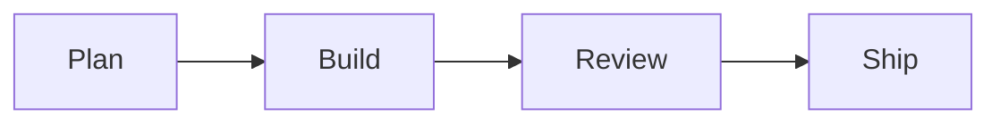

# sc-mods

Claude Code mods from SimpleClaude. A mod is a plugin that changes Claude Code's own interface; see the [mods documentation](https://code.claude.com/docs/en/plugins/mods/overview).

sc-mods does three things:

- It draws the mermaid diagrams in Claude's replies as Unicode text, so you can read a diagram in the terminal without copying it into a renderer.
- It puts `◀` and `▶` buttons in the band above the prompt, which scroll the conversation to your previous or next prompt.
- It puts a `⧉ copy` button under Claude's replies, which copies the reply's markdown.

## Mermaid diagrams

When a reply contains a closed mermaid code block, the mod runs [merman](https://github.com/Latias94/merman) on the diagram and shows the drawing in place of the source. Nothing else in the reply changes, and the conversation the model sees still holds the mermaid source.

Before:

````markdown

````

After:

```text
┌──────┐   ┌───────┐   ┌────────┐   ┌──────┐
│      │   │       │   │        │   │      │
│ Plan ├──►│ Build ├──►│ Review ├──►│ Ship │
│      │   │       │   │        │   │      │
└──────┘   └───────┘   └────────┘   └──────┘
```

A mermaid code block is one whose fence is three or more backticks or tildes and whose language, the first word after the fence, is `mermaid` in any case. It closes on the same fence character repeated at least as many times. A block indented inside a list item or a `>` blockquote is drawn there, with the drawing kept inside the item or quote. A mermaid block inside another code block, such as a ` ````markdown ` example, or inside an HTML comment, is left as it is.

The drawing has to fit the terminal's width. For a flowchart that is too wide, the mod tries a compact layout, then wraps long node labels, then turns a left-to-right chart top-to-bottom. A sequence diagram gets a second, automatic layout. If no layout fits, or merman cannot read the diagram, the source stays as it was.

## Jump between prompts

The band above the prompt shows two buttons, `◀` and `▶`, with a dim count between them: `[ ◀ ] 2/5 [ ▶ ]` while the arrows are on the second of five prompts. Click a button to scroll the conversation so your previous or next prompt sits at the top of the view. The hotkeys `1` and `2` press the buttons while the band holds the keyboard: press ctrl+x then tab to move the keyboard to the band, or click in it; Esc returns it to the prompt box.

The arrows count the prompts you have sent since the mod loaded and step from the prompt they last jumped to; each new prompt you send puts them back on the newest. Scrolling the conversation yourself does not move them. A toast says so when there is no earlier or later prompt, and gives Claude Code's reason when it does not scroll.

Jumping needs fullscreen mode, where Claude Code draws the conversation itself. The classic layout leaves the conversation to the terminal's scrollback and refuses the scroll.

## Copy a reply

A dim `⧉ copy` button sits under each block of Claude's reply text. Click it to put that block's markdown on the clipboard, as Claude wrote it: a mermaid diagram is copied as its source, not as the drawing. A toast says how many characters were copied, or why nothing was. A reply split by tool calls has a button under each block of text.

The button takes a mouse click only. The conversation's rows can't take keyboard focus, so no key presses it.

## Install

```bash
claude plugin install sc-mods --marketplace kylesnowschwartz/SimpleClaude
```

The plugin holds no merman binary. The first time a diagram needs drawing, `bin/merman-cli` downloads the merman release archive for your machine from [merman's GitHub releases](https://github.com/Latias94/merman/releases), checks it against the sha256 pinned in [`bin/merman.pin`](bin/merman.pin), and keeps the binary and merman's licenses in `${XDG_CACHE_HOME:-~/.cache}/sc-mods/merman-<version>/`. Later sessions run the cached binary, so the network is needed once per merman version. A plugin update that pins a new version downloads it and removes the old one from the cache.

merman-cli runs on macOS and on Linux with glibc, on arm64 and x86_64. The download needs `curl` and `shasum` or `sha256sum`, and on Linux also `xz`.

**A mod runs with your permissions.** It runs inside Claude Code and can start programs as you. This one starts merman-cli to draw diagrams. Its only network call and its only file writes are the merman download above. The copy button writes to the clipboard through Claude Code, the way `/copy` does. Read [`hooks/register.ts`](hooks/register.ts) and [`bin/merman-cli`](bin/merman-cli) before you install it.

## Settings

| Setting | What it does |
|---|---|
| `MERMAN_PATH` | Absolute path to a merman-cli to run instead of the downloaded one. With it set, nothing is downloaded. Set it at install with `--config MERMAN_PATH=/path/to/merman-cli`, or later with `/plugin configure`. |

If merman-cli cannot run, every diagram stays as source and Claude Code shows one notice with the reason, such as a failed download or a missing `curl`.

## Development

Load the plugin from the checkout, either for one session:

```bash
claude --plugin-dir plugins/sc-mods
```

or as an installed plugin that reads straight from your checkout:

```bash
claude plugin marketplace add /path/to/SimpleClaude
claude plugin install sc-mods@simpleclaude
```

Then edit the files and run `/reload-plugins`.

Check and test the mod:

```bash
just test-mods
```

These tests stand in for merman-cli, so they need no binary. `just test` includes the launcher's tests, which download from local archives rather than the network. To draw a flowchart, a sequence diagram and an invalid diagram with the real merman-cli, install [bun](https://bun.sh), then run:

```bash
just test-mods-real
```

It downloads merman-cli into the cache if it is not there, and stops with the launcher's reason if merman-cli cannot run on your machine.

### Upgrade merman

`just check-merman` reports whether a newer merman release is out. To move to it:

1. `just update-merman <version>` writes the version and the published checksum of each platform's archive to `bin/merman.pin`.
2. `just test-mods` and `just test-mods-real`.
3. Check a few diagrams live in `claude --plugin-dir plugins/sc-mods`.
4. Commit, then release with `just bump` and `just release`.

## Limitations

- A mermaid block without a closing fence shows its source.
- Some merman drawings have layout quirks: a flowchart edge that loops back runs against the boxes ([#183](https://github.com/Latias94/merman/issues/183)), a state diagram can print two transition labels run together ([#184](https://github.com/Latias94/merman/issues/184)), a long sequence message label can run past the next lifeline ([#185](https://github.com/Latias94/merman/issues/185)), and in a narrow terminal two side-by-side subgraphs can share a border ([#186](https://github.com/Latias94/merman/issues/186)).
- The jump buttons count the prompts sent since the mod loaded. Prompts a session held before then (a restart, `/resume`, a plugin reload) are not counted; Claude Code does not draw those rows, so there is nothing to scroll to.
- After a rewind (Esc Esc, or editing an earlier prompt), the prompts the rewind went back past stay counted until `/clear` or `/resume`.
- The jump buttons step through the main conversation, and are hidden while an agent's transcript is on screen.
- The mod is built for the terminal. The desktop app and the VS Code extension are untested.
- merman publishes merman-cli for macOS and glibc Linux only. On other systems, musl Linux such as Alpine included, the diagrams stay as source unless `MERMAN_PATH` points at a merman-cli.
- The first diagram after a new merman version waits for the download. If the download takes longer than 15 seconds, that reply keeps its source and the next diagram tries again.
