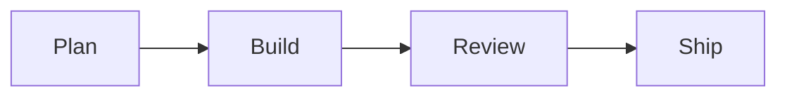

# sc-mods

Claude Code mods from SimpleClaude. A mod is a plugin that changes Claude Code's own interface; see the [mods documentation](https://code.claude.com/docs/en/plugins/mods/overview).

sc-mods holds one mod today: it draws the mermaid diagrams in Claude's replies as Unicode text, so you can read a diagram in the terminal without copying it into a renderer.

## What it does

When a reply contains a closed mermaid code block, the mod runs [merman](https://github.com/Latias94/merman) on the diagram and shows the drawing in place of the source. Nothing else in the reply changes, and the conversation the model sees still holds the mermaid source.

Before:

````markdown

````

After:

```text
┌──────┐   ┌───────┐   ┌────────┐   ┌──────┐
│      │   │       │   │        │   │      │
│ Plan ├──►│ Build ├──►│ Review ├──►│ Ship │
│      │   │       │   │        │   │      │
└──────┘   └───────┘   └────────┘   └──────┘
```

A mermaid code block is one whose fence is three or more backticks or tildes and whose language, the first word after the fence, is `mermaid` in any case. It closes on the same fence character repeated at least as many times. A block indented inside a list item or a `>` blockquote is drawn there, with the drawing kept inside the item or quote. A mermaid block inside another code block, such as a ` ````markdown ` example, or inside an HTML comment, is left as it is.

The drawing has to fit the terminal's width. For a flowchart that is too wide, the mod tries a compact layout, then wraps long node labels, then turns a left-to-right chart top-to-bottom. A sequence diagram gets a second, automatic layout. If no layout fits, or merman cannot read the diagram, the source stays as it was.

## Install

```bash
claude plugin install sc-mods --marketplace kylesnowschwartz/SimpleClaude
```

This installs from the `sc-mods-dist` branch, which carries merman-cli for macOS and Linux on arm64 and x86_64. Nothing is downloaded when the mod runs.

**A mod runs with your permissions.** It runs inside Claude Code and can start programs as you. This one starts only merman-cli, it makes no network calls, and it writes no files. Read [`hooks/register.ts`](hooks/register.ts) before you install it.

## Settings

| Setting | What it does |
|---|---|
| `MERMAN_PATH` | Absolute path to a merman-cli to run instead of the bundled one. Leave it unset to use the bundled one. Set it at install with `--config MERMAN_PATH=/path/to/merman-cli`, or later with `/plugin configure`. |

If merman-cli cannot run, every diagram stays as source and Claude Code shows one notice saying how to fix it.

## Development

The binaries are not in the main branch. Fetch them into `bin/` first:

```bash
just fetch-merman
```

This runs `scripts/fetch-merman.sh`, which downloads the pinned merman release, checks each archive against its published checksum, and puts one binary per platform beside the `bin/merman-cli` launcher, with merman's licenses in `bin/merman-licenses/`. Running it again does nothing. `just check-merman` reports whether a newer merman release is out.

Then load the plugin from the checkout, either for one session:

```bash
claude --plugin-dir plugins/sc-mods
```

or as an installed plugin that reads straight from your checkout:

```bash
claude plugin marketplace add /path/to/SimpleClaude
claude plugin install sc-mods-dev@simpleclaude
```

With `sc-mods-dev`, edit the files and run `/reload-plugins`. Don't install `sc-mods` and `sc-mods-dev` together, or every diagram is handled twice.

Check and test the mod:

```bash
just test-mods
```

These tests stand in for merman-cli, so they run without the binaries. To draw a flowchart, a sequence diagram and an invalid diagram with the real merman-cli, fetch the binaries and install [bun](https://bun.sh), then run:

```bash
just test-mods-real
```

It stops with an error if merman-cli cannot run on your machine.

Every `just release` republishes the `sc-mods-dist` branch. To publish it on its own, run `just publish-mods`, which stops unless all four binaries are present.

## Limitations

- A mermaid block without a closing fence shows its source.
- Some merman drawings have layout quirks: a flowchart edge that loops back runs against the boxes ([#183](https://github.com/Latias94/merman/issues/183)), a state diagram can print two transition labels run together ([#184](https://github.com/Latias94/merman/issues/184)), a long sequence message label can run past the next lifeline ([#185](https://github.com/Latias94/merman/issues/185)), and in a narrow terminal two side-by-side subgraphs can share a border ([#186](https://github.com/Latias94/merman/issues/186)).
- The mod is built for the terminal. The desktop app and the VS Code extension are untested.
- merman-cli ships for macOS and Linux. On other systems the diagrams stay as source unless `MERMAN_PATH` points at a merman-cli.
